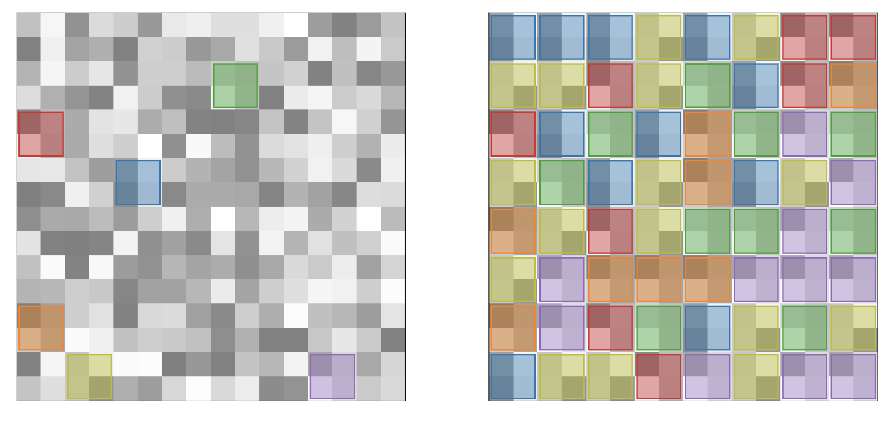

# Algorithmic Simplification of Neural Networks with Mosaic-of-Motifs



This is the official repository for the paper *Algorithmic Simplification of Neural Networks with Mosaic-of-Motifs*.
**Authors:**
Pedram Bakhtiarifard, Tong Chen, Jonathan Wenshøj, Erik B Dam, Raghavendra Selvan <br>
**Affiliation:**
University of Copenhagen, Department of Computer Science, Machine Learning Section, SAINTS Lab

## Get Started

```bash
python3.12 -m venv .venv
source .venv/bin/activate
python -m pip install --upgrade pip
python -m pip install torch torchvision timm wandb pyyaml tqdm rich pandas numpy matplotlib seaborn scikit-learn
```

Optional (only for `bdm_complexity`):

```bash
python -m pip install pybdm
```

Compression metrics use Python standard library modules `gzip`, `bz2`, and `lzma`.

## Examples

```bash
# Baseline
python momos/src/run.py --model resnet20 --prefix BASELINE

# QAT
python momos/src/run.py --model resnet20 --quantize --method qat --q 8 --prefix QAT_Q8

# MoMos with s + capacity
python momos/src/run.py --model mlp --quantize --method momos --s 4 --capacity 0.01 --q 32 --force_zero --prefix MOMOS_S4_C001

# MoMos + BDM/compression metrics
python momos/src/run.py --model mlp --quantize --method momos --s 4 --capacity 0.01 --q 32 --force_zero --metrics bdm,gzip,bz2,lzma --prefix MOMOS_BDM
```

Standalone MoMos usage:

```python
from momos.src.quantizers import MoMos

momos = MoMos(s=4, capacity=0.01, q=32, force_zero=True)

for x, y in loader:
    optimizer.zero_grad(set_to_none=True)
    loss = criterion(model(x), y)
    loss.backward()
    optimizer.step()
    q_stats = momos(model)
```

## Citation
If you use this work in your research, please cite:
```bibtex
@misc{bakhtiarifard2026momos,
      title={Algorithmic Simplification of Neural Networks with Mosaic-of-Motifs}, 
      author={Pedram Bakhtiarifard and Tong Chen and Jonathan Wenshøj and Erik B Dam and Raghavendra Selvan},
      year={2026},
      eprint={2602.14896},
      archivePrefix={arXiv},
      primaryClass={cs.LG},
      url={https://arxiv.org/abs/2602.14896}, 
}
```

If you have questions or would like to discuss this work, feel free to reach out to
- pba@di.ku.dk  
- raghav@di.ku.dk
